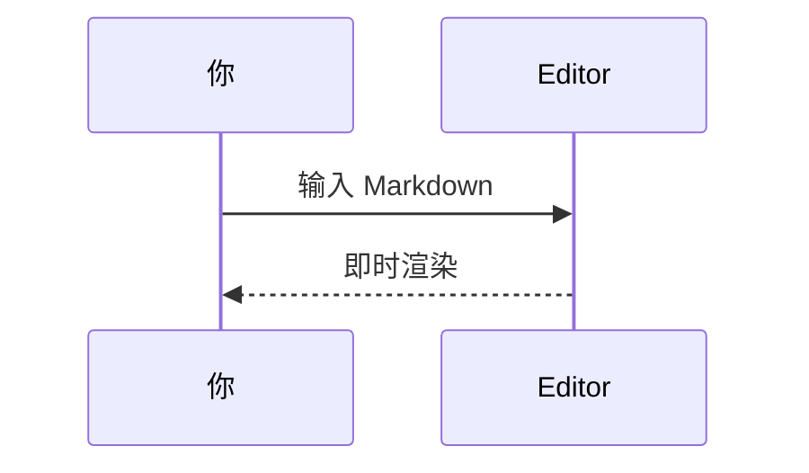

# Markdown

欢迎使用 **Markdown** —— 纯前端 Markdown 编辑器。左侧编辑，右侧实时预览（对齐 VS Code 的 `markdown-it` 能力）。

[[toc]]

## 基础语法

*斜体*、**粗体**、***粗斜体***、~~删除线~~、`行内代码`

> 引用可以嵌套想法：写作时先想清楚结构。

| RPC | Handler | 说明 |
|-----|---------|------|
| `createGame` | `GameCreateSHandler.createGame` | 选择 Game 节点，转发创建请求 |
| `joinGame` | `GameJoinSHandler.joinGame` | 校验席位后进入房间 |

- [x] 实时预览
- [x] 暗色主题
- [ ] 同步到云端（当前仅本地缓存）

上标 H~2~O 与下标 X^2^，高亮 ==mark==，插入 ++ins++。

:sparkles: Emoji 与 HTML 实体：&copy;

## 代码

```ts
function greet(name: string) {
  return `Hello, ${name}!`
}
```

## 数学

行内公式 $E = mc^2$，块级：

$$
\int_{0}^{1} x^2 \, dx = \frac{1}{3}
$$

## 提示容器

::: tip 提示
可以用菜单「插入」快速放入常用片段。
:::

::: warning 注意
内容保存在浏览器本地缓存，清空站点数据会丢失。
:::

::: info 信息
支持隐藏编辑区或预览区，专注写作或阅读。
:::

## Mermaid




## 定义列表

Term
: 定义内容

[^1]: 脚注示例 —— 点击可跳转回来。
